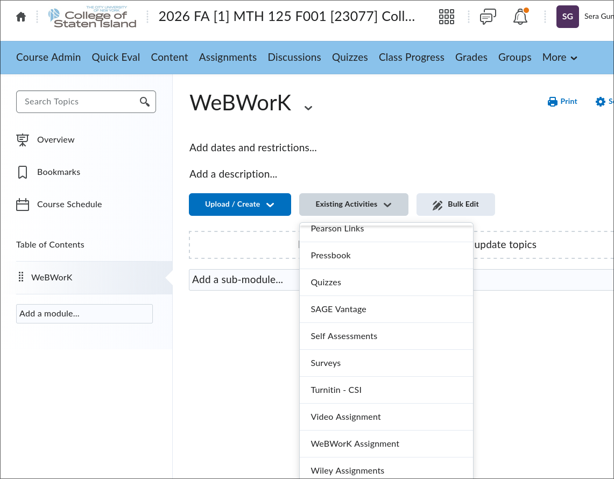
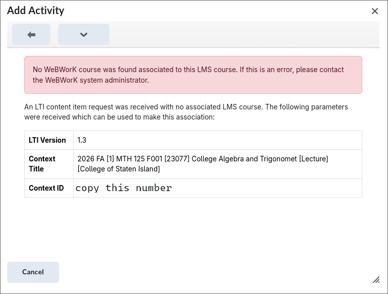
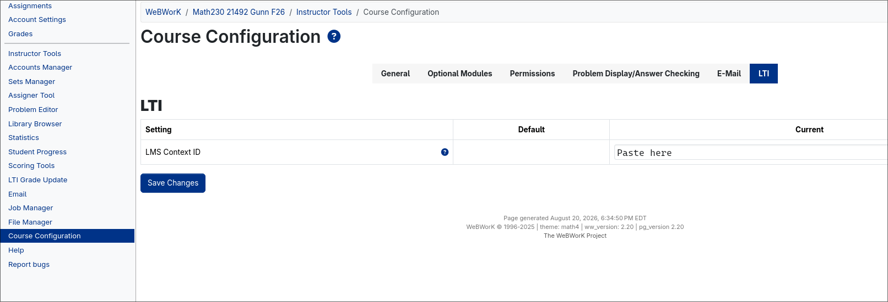

-----------------------------------

# Notes for instructors using WeBWorK and Brightspace

As of Fall 2026, we will be using Brightspace as a front end for WeBWorK.  Students will not have a 
separate WeBWorK login, they will see the WeBWorK questions after logging in to Brightspace.

In order for this to work, the course instructor needs to link their Brightspace course to the 
corresponding WeBWorK course.  This page explains how to do this.

- You will need a Brightspace login, and be able to see your course in Brightspace.

- You will also need be able to login to the corresponding webwork course created on the department's 
webwork server here:

[https://www.math.csi.cuny.edu/WeBWorK/courses.html](https://www.math.csi.cuny.edu/WeBWorK/courses.html)

Note that an account for a student on WeBWorK won't be created until the student logins in to 
Brightspace and attempts to access the questions from there.

## Instructions

* In Brightspace, go the course, and then go to “Content”, then “Add a module” to create a place to store the
  link(s) to WeBWorK.

* From the module, follow “Existing Activities” => “WeBWorK Assignment"

{width=600 fig-alt="Brightspace existing activities screenshot"}

* The first time this link is followed, you will see an error message saying that there is no WeBWorK 
  course associated with the Brightspace course. The message contains a "Context ID”.  You will need to 
  copy and paste this number into WeBWorK to link the two courses.

{width=600 fig-alt="Brightspace Context ID screenshot"}

* Now log in to the WeBWorK course.  Follow the links to "Course Configuration” => LTI.  Paste the 
  "Context ID” number in as "LMS Context ID”.

{width=800 fig-alt="WeBWorK Course Configuration screenshot"}

* Go back to Brightspace and follow the link  “Existing Activities” => “WeBWorK Assignment”, and you should
  see the following menu:

  Available Content:
   *  Assignments (Course Home): 
  Choosing this will create one link to WeBWorK for students and creates one grade book column called “WeBWorK
  Assignments” with 100(%) grade possible.
   *  Visible Sets:
   *  Select all sets
   *  List of Individual sets ...

For most courses, you will want to check __only__ the Assignments box, which will create a __single__ link from 
which the students can see the WeBWorK questions.  It will also create a __single__ gradebook entry.

----------------

It is possible to link each webwork assignment individually in Brightspace if you prefer, with multiple 
gradebook columns.  Here are instructions to do that:

* Go back to your WeBWorK course. Your role in the course must be "admin". If your role for instructor 
  is only "professor", ask for your WeBWorK admin for the "admin" permission level.

* File Manager => above the Templates directory => edit the course.conf file and add the following line to the
  end of the file: $LTIGradeMode='homework';

* Go back to the Brightspace course and select one or more of the sets from the list. Note that only
  assignments made visible in WeBWorK are listed. After "Submit Choices” is  clicked, the associated grade
  book items should be also created.

